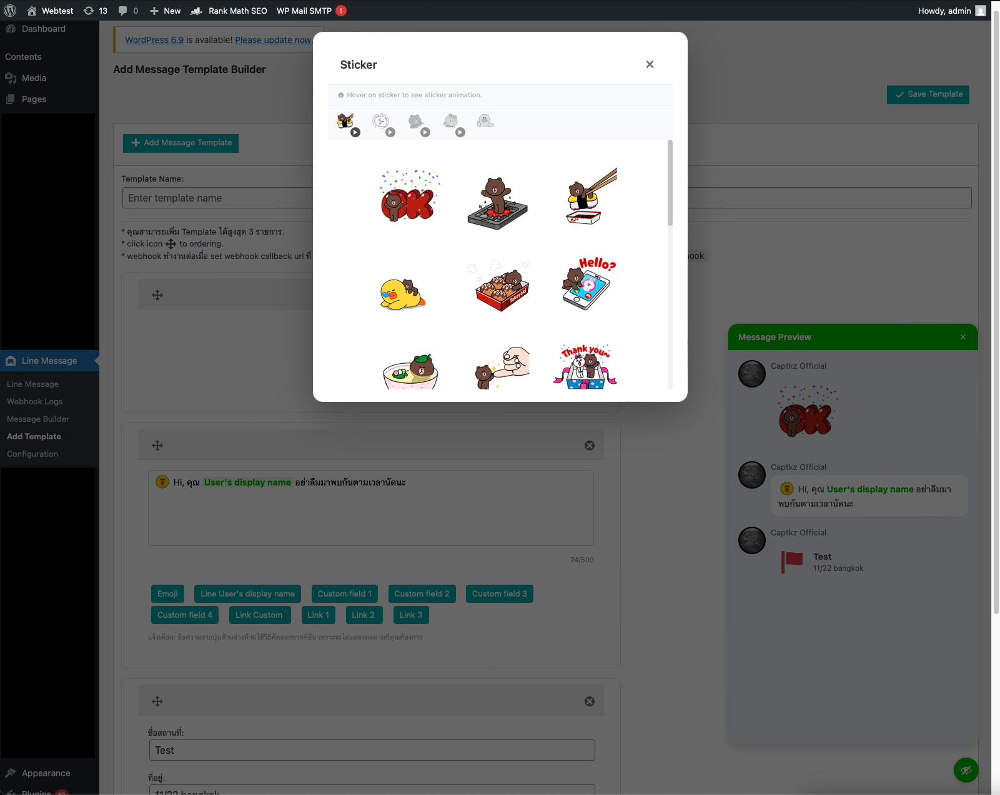

# wp-plugin-line-message-builder

the plugin for wordpress to create message json template use to send in line message

## Feature

- create json template

## How to use

- login to admin
- upload plugin

## Testing

- test on wordpress to version 6.9

## Screenshots

